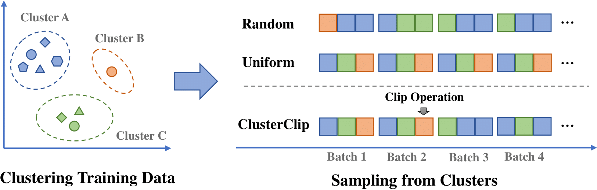

# Balanced Data Sampling for Language Model Training with Clustering

This repository contains the code for our paper "[Balanced Data Sampling for Language Model Training with Clustering](https://arxiv.org/abs/2402.14526)". We introduce a balanced data sampling method, ClusterClip, which encoporates data clustering to reflect the distribution of the training set and balance common and rare samples during training for better generalization. ClusterClip utilizes data clustering to describe the training data distribution. Then, it balances the sampling probabilities of samples in different clusters during the training. Moreover, a clip operation is introduced to knock out samples with too many repetitions.

<p align="center">
    llustration of ClusterClip Sampling. 
     <br>
    <br>
</p>

# Usage
You can use this repo to cluster and preprocess your data for ClusterClip training. This repo supports large scale data processing (e.g. 100B or 200B Tokens) with **multi-node** and **multi-GPU** acceleration.
The following steps are required to use ClusterClip:
1. Prepare your data in a jsonl format.
2. Run the encoder to encode your data into embeddings.
3. Run the K-means to cluster your data.
4. Group your data into clusters for training.

## 1. Data Preparation
Prepare your data in a jsonl format. Each line should be a json object with a "content" field. For example:
```json
{"content": "This is a sample training sample."}
{"content": "This is another sample document."}
```

Then set the path to your data in the `DATA_DIR` environment variable, and set corresponding paths for the embeddings and clusters:
```bash
export DATA_DIR=/raw/data_dir
export EMB_DIR=/embs/data_dir
export CLUSTER_DIR=/cluster/data_dir
```

## 2. Encoding
Run the encoder to encode your data into embeddings. The encoder is based on the Huggingface transformers library. You can use any embedding model from the library. For example, to encode your data using `jinaai/jina-embeddings-v2-base-en`, run the following command:
```bash
torchrun \
    --nproc_per_node 8 --nnodes 1  \
    run_gen_emb.py \
        --input_dirs $DATA_DIR \
        --output_dirs $EMB_DIR \
        --model_name jinaai/jina-embeddings-v2-base-en \
```

## 3. Clustering
Run the K-means to cluster your data. The following command will cluster your data into 2000 clusters:
```bash
torchrun \
    --nnodes 1 --nproc_per_node 8 \
    kmeans.py \
    --data_path $EMB_DIR \
    --nmb_prototypes 2000 \
    --batch_size 1024 \
    --nmb_kmeans_iters 300 \
    --distance cosine \
    --nmb_runs 1
```

## 4. Grouping
Group your data into clusters for training. The following command will group your data into 2000 folders, each containing samples from the corresponding cluster:
```bash
python group_data.py \
    --input_dirs $EMB_DIR \
    --data_dirs $DATA_DIR \
    --output_dirs $CLUSTER_DIR \
    --num_clusters 2000
```

After running the above commands, your data will be grouped into clusters. The directory structure will look like this:
```
/cluster/data_dir
    ├── cluster_0
    │   └── data_0.jsonl
    ├── cluster_1
    │   └── data_0.jsonl
    ├── cluster_10
    │   └── data_0.jsonl
    ├── cluster_11
    │   └── data_0.jsonl
    ├── cluster_12
    │   └── data_0.jsonl
    ├── cluster_13
    │   └── data_0.jsonl
    ├── cluster_14
    │   └── data_0.jsonl
    ├── cluster_15
    │   └── data_0.jsonl
    ├── cluster_16
```

You can now use the grouped data for training your language model with ClusterClip Sampling.

# Citation
If you find this work useful, please cite our paper:
```bibtex
@article{clusterclip,
  title={Balanced Data Sampling for Language Model Training with Clustering},
  author={Yunfan Shao and Linyang Li and Zhaoye Fei and Hang Yan and Dahua Lin and Xipeng Qiu},
  journal={arXiv preprint arXiv:2402.14526},
  year={2024}
}
```
